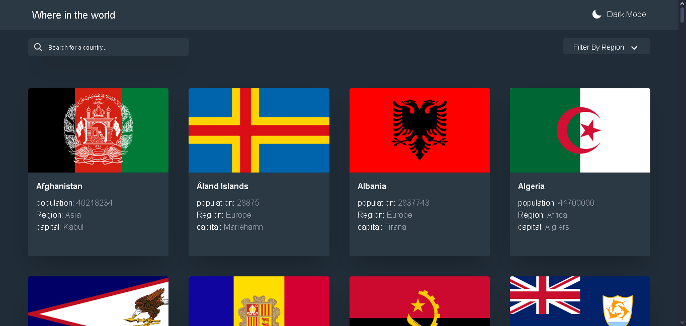

# Frontend Mentor - REST Countries API with color theme switcher solution

This is a solution to the [REST Countries API with color theme switcher challenge on Frontend Mentor](https://www.frontendmentor.io/challenges/rest-countries-api-with-color-theme-switcher-5cacc469fec04111f7b848ca). Frontend Mentor challenges help you improve your coding skills by building realistic projects. 

## Table of contents

- [Overview](#overview)
  - [The challenge](#the-challenge)
  - [Screenshot](#screenshot)
  - [Links](#links)
- 

### The challenge

Users should be able to:

- See all countries from the API on the homepage
- Search for a country using an `input` field
- Filter countries by region
- Click on a country to see more detailed information on a separate page
- Click through to the border countries on the detail page
- Toggle the color scheme between light and dark mode *(optional)*

### Screenshot

### Links

- Solution URL: [Add solution URL here](https://github.com/bos-code/rest-countries-api-with-color-theme-switcher)
- Live Site URL: [Add live site URL here](https://rest-countries-api-with-color-theme-switcher-pi-six.vercel.app/)

## My process

### Built with

- Semantic HTML5 markup
- Tailwind css
- Flexbox
- CSS Grid
- Mobile-first workflow
For styles

### What I learned
i learnt efficient use of array methods

### Continued development

Use this section to outline areas that you want to continue focusing on in future projects. These could be concepts you're still not completely comfortable with or techniques you found useful that you want to refine and perfect.

anyone viewing your solution or for yourself when you look back on this project in the future.**

## Author

- Frontend Mentor - [@yourusername](https://www.frontendmentor.io/profile/bos-code)

